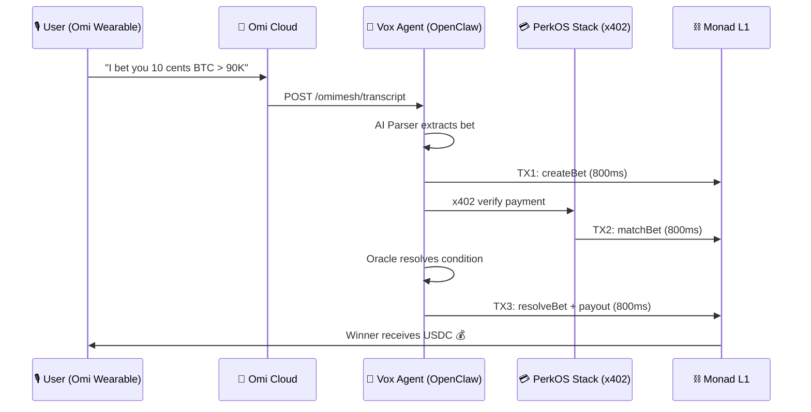
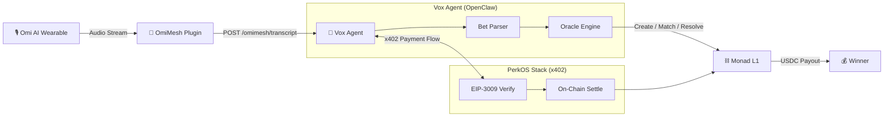
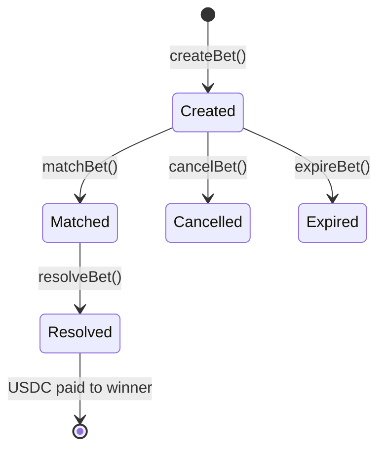
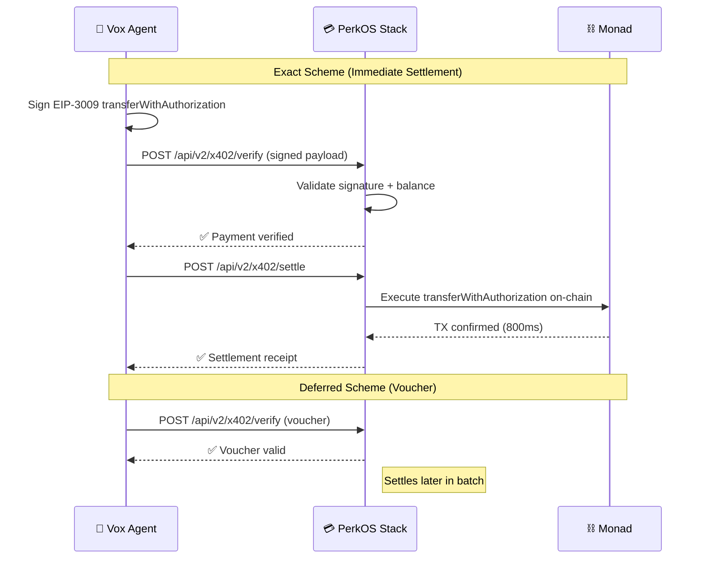

<div align="center">

# 🎲 PerkOS Vox — VoiceBet Arena

### *"Just say it. Bet it. Settle it. 800ms."*

**Voice-powered micro-betting on Monad.** Two people talk → AI detects *"I bet you $0.10 that..."* → funds lock on-chain in 800ms → AI resolves → winner gets paid. No app. No clicks. Just conversation.

[](https://vox.perkos.xyz)
[](https://agent-vox.perkos.xyz/health)
[](https://stack.perkos.xyz)
[-7C3AED?style=for-the-badge)](https://monadscan.com/address/0x0b3b319145543da36E5e9Bf07BF66e67B28260A5)
[](https://monadscan.com/address/0x0b3b319145543da36E5e9Bf07BF66e67B28260A5)

> *"Made 6 bets during lunch. All settled on-chain in 7.5 seconds total."*

</div>

---

## ⚡ The Problem

Betting between friends is broken: handshake bets are forgotten, Venmo is manual, and on-chain betting is slow and expensive. **What if your voice was the interface?**

## 💡 The Solution

PerkOS Vox turns casual conversation into **trustless, on-chain micro-bets** using an AI wearable, an AI oracle, and Monad's 800ms finality — with [x402](https://www.x402.org/) micropayments facilitated by [PerkOS Stack](https://stack.perkos.xyz).

---

## 🏗️ Architecture

### End-to-End Flow



### System Architecture



### Smart Contract State Machine



### x402 Payment Flow (PerkOS Stack)



---

## 🎯 How It Works

| Step | What Happens | Time |
|------|-------------|------|
| 1️⃣ **Detect** | Omi wearable hears *"I bet..."* or *"wanna bet?"* | Real-time |
| 2️⃣ **Parse** | AI extracts `{ condition, amount, parties, category, deadline }` | ~200ms |
| 3️⃣ **Lock** | `createBet()` → USDC locks in escrow on Monad | **800ms** ⚡ |
| 4️⃣ **Match** | Party B matched via `matchBet()` — auto or manual | **800ms** ⚡ |
| 5️⃣ **Resolve** | Oracle checks condition (API, AI judgment, or confirmation) | Auto |
| 6️⃣ **Payout** | `resolveBet()` → winner receives 2× bet minus 2% fee | **800ms** ⚡ |

**3 on-chain transactions per bet** (create + match + resolve). Full lifecycle in ~5-7 seconds.

---

## 🔑 Key Features

### 🎙️ Voice Detection
The [Omi AI wearable](https://omi.me) captures natural speech continuously. When it detects bet-like language, transcripts are sent to the Vox Agent via the [OmiMesh](https://github.com/PerkOS-xyz/OmiMesh) plugin webhook.

### 🧠 AI Bet Parser
Extracts structured bet data from natural language:
- **Amount:** Supports `$0.10`, `ten cents`, `a dime`, `fifty cents`, `a dollar`
- **Condition:** `"BTC above 90K"`, `"it'll rain tomorrow"`, `"Lakers win tonight"`
- **Category:** Auto-classified into one of 5 categories
- **Deadline:** Parsed from `"by Friday"`, `"tomorrow"`, `"in 1 hour"`

### 📋 5 Bet Categories

| Category | Example | Oracle Source |
|----------|---------|---------------|
| 🪙 **crypto_price** | *"I bet $0.10 BTC is above 90K"* | [CoinGecko API](https://www.coingecko.com/) (auto) |
| 🌤️ **weather** | *"I bet $0.10 it rains in Denver"* | [wttr.in](https://wttr.in/) (auto) |
| ⚽ **sports** | *"I bet $0.10 Lakers win tonight"* | Sports API (auto) |
| 🧠 **trivia** | *"I bet $0.10 the capital of Mongolia is..."* | AI instant resolve |
| 🎲 **fun_social** | *"I bet $0.10 you can't do 20 pushups"* | Voice confirmation |

### 💳 x402 Payments via PerkOS Stack
[PerkOS Stack](https://stack.perkos.xyz) acts as the **x402 payment facilitator**:
- **EIP-3009** `transferWithAuthorization` — gasless USDC transfers
- **Exact scheme** — immediate on-chain settlement
- **Deferred scheme** — voucher-based, batch-settled later
- **Multi-chain** — supports Monad, Base, and more
- **Endpoints:** `/api/v2/x402/verify` and `/api/v2/x402/settle`

### 📊 Real-time Dashboard
Live at [vox.perkos.xyz](https://vox.perkos.xyz):
- Polls the agent API every 15 seconds
- Live bet feed with status indicators
- Transaction ticker with Monadscan links
- Leaderboard and volume stats

### 🔮 Auto Lifecycle
Every bet follows the full path automatically:
1. `createBet()` — Party A's USDC locked in escrow
2. `matchBet()` — Party B automatically matched
3. Oracle resolves the condition
4. `resolveBet()` — winner receives payout

All 3 transactions settle in **~5-7 seconds total** on Monad.

---

## 📊 Live Demo Results

```
┌─────────────────────────────────────────────────┐
│           🏁 BENCHMARK: 6 BETS                  │
│                                                  │
│   Total time:     7.5 seconds                    │
│   Avg per bet:    1.25s (create + match + pay)   │
│   On-chain txs:   18+                            │
│   Gas cost:       ~$0.03 total                   │
│                                                  │
│   ⚡ vs Ethereum: 10x faster, 4000x cheaper      │
│   ⚡ vs Solana:   Comparable speed, true L1       │
└─────────────────────────────────────────────────┘
```

| Metric | Monad (Vox) | Ethereum | Improvement |
|--------|-------------|----------|-------------|
| Finality | 800ms | ~12 min | **900×** |
| 6 bets settled | 7.5s | ~72 min | **576×** |
| Gas for 6 bets | ~$0.03 | ~$120 | **4,000×** |
| Avg TX time | 800ms–1.7s | ~15s+ | **10×** |

---

## 🛠️ Tech Stack

| Layer | Technology | Role |
|-------|-----------|------|
| **Voice Capture** | [Omi AI Wearable](https://omi.me) | Always-on voice → transcript |
| **Plugin Bridge** | [OmiMesh](https://github.com/PerkOS-xyz/OmiMesh) | Webhook relay to Vox Agent |
| **AI Agent** | [OpenClaw](https://openclaw.ai) | Bet parsing, resolution, tx execution |
| **Payments** | [PerkOS Stack](https://stack.perkos.xyz) (x402) | EIP-3009 micropayment facilitation |
| **Settlement** | [Monad](https://monad.xyz) (Chain 143) | 10K TPS, 800ms finality, USDC escrow |
| **Dashboard** | [Next.js 16](https://nextjs.org/) + Tailwind | Real-time bet feed at [vox.perkos.xyz](https://vox.perkos.xyz) |
| **Contracts** | [Foundry](https://book.getfoundry.sh/) | Smart contract dev, test, deploy |

---

## 📜 Smart Contract — `VoiceBetEscrow.sol`

Deployed on **Monad Mainnet** • [View on Monadscan →](https://monadscan.com/address/0x0b3b319145543da36E5e9Bf07BF66e67B28260A5)

**Features:**
- 5 bet categories with oracle-based resolution
- Bet range: **$0.01 – $1.00** (USDC, 6 decimals)
- 2% platform fee (200 bps), max 5%
- `ReentrancyGuard` + `SafeERC20`
- Auto-expire with full refund
- On-chain stats: `totalBets`, `totalVolume`, `totalResolved`

| Contract | Address | Network |
|----------|---------|---------|
| **VoiceBetEscrow** | [`0x0b3b319145543da36E5e9Bf07BF66e67B28260A5`](https://monadscan.com/address/0x0b3b319145543da36E5e9Bf07BF66e67B28260A5) | Monad (143) |
| **USDC** (Circle CCTP) | [`0x754704Bc059F8C67012fEd69BC8A327a5aafb603`](https://monadscan.com/address/0x754704Bc059F8C67012fEd69BC8A327a5aafb603) | Monad (143) |

---

## 📡 API Reference

Base URL: `https://agent-vox.perkos.xyz`

### Health & Status

| Method | Endpoint | Description |
|--------|----------|-------------|
| `GET` | `/health` | Service health check |
| `GET` | `/bets` | List all detected/processed bets |
| `GET` | `/api/stats` | Volume, count, and speed statistics |

### Bet Lifecycle

| Method | Endpoint | Description |
|--------|----------|-------------|
| `POST` | `/api/bet` | Create a new bet from structured data |
| `POST` | `/api/match/:id` | Match an existing bet (Party B) |
| `POST` | `/api/resolve/:id` | Resolve a bet with oracle result |

### OmiMesh Integration

| Method | Endpoint | Description |
|--------|----------|-------------|
| `POST` | `/omimesh/transcript` | Receive voice transcript from Omi wearable |
| `POST` | `/omimesh/memory` | Store conversation context |
| `GET` | `/omimesh/status` | OmiMesh connection status |

### Webhook

| Method | Endpoint | Description |
|--------|----------|-------------|
| `POST` | `/webhook/transcript` | Generic transcript webhook (OmiMesh relay) |

### Example Request

```bash
# Create a bet via transcript
curl -X POST https://agent-vox.perkos.xyz/omimesh/transcript \
  -H "Content-Type: application/json" \
  -d '{
    "text": "I bet you ten cents that Bitcoin is above 90K right now",
    "speaker": "user_1",
    "timestamp": 1739836200
  }'
```

### Example Response

```json
{
  "bet_detected": true,
  "bet": {
    "amount": 0.10,
    "condition": "BTC above 90K",
    "category": "crypto_price",
    "deadline": "immediate",
    "tx_hash": "0x..."
  },
  "status": "created"
}
```

---

## 📁 Project Structure

```
Monad-Denver-2026/
├── contracts/                      # Foundry — Monad smart contracts
│   ├── src/VoiceBetEscrow.sol      # Escrow contract (12/12 tests ✅)
│   ├── test/VoiceBetEscrow.t.sol   # Full test suite
│   ├── script/Deploy.s.sol         # Deployment script
│   └── foundry.toml
├── agent/                          # Vox — AI agent
│   ├── SOUL.md                     # Agent persona & rules
│   ├── bet-parser.ts               # Intent detection + structuring
│   ├── oracle.ts                   # Resolution logic (APIs + AI)
│   └── x402-pay.ts                 # PerkOS x402 payment integration
├── webapp/                         # Next.js dashboard
│   ├── app/page.tsx                # Main dashboard
│   ├── components/
│   │   ├── TxTicker.tsx            # Live Monad tx feed
│   │   ├── BetBoard.tsx            # Active bets board
│   │   ├── Leaderboard.tsx         # Player rankings
│   │   └── Stats.tsx               # Volume & speed stats
│   └── lib/monad.ts                # RPC + contract interaction
└── README.md
```

---

## 🚀 Quick Start

### Prerequisites

- Node.js 18+, pnpm
- Foundry (`curl -L https://foundry.paradigm.xyz | bash`)
- Monad RPC: `https://rpc.monad.xyz`

### 1. Clone & Install

```bash
git clone https://github.com/PerkOS-xyz/monad-perkos-vox.git
cd monad-perkos-vox
```

### 2. Smart Contracts

```bash
cd contracts
forge install
forge test          # 12/12 tests passing ✅
forge build
```

### 3. Web Dashboard

```bash
cd webapp
pnpm install
cp .env.example .env.local    # Add your RPC & contract addresses
pnpm dev                      # http://localhost:3000
```

### 4. Agent

```bash
cd agent
# Configure SOUL.md with your gateway settings
# Start via OpenClaw CLI
openclaw gateway start
```

### Environment Variables

```env
NEXT_PUBLIC_MONAD_RPC=https://rpc.monad.xyz
NEXT_PUBLIC_ESCROW_ADDRESS=0x0b3b319145543da36E5e9Bf07BF66e67B28260A5
NEXT_PUBLIC_USDC_ADDRESS=0x754704Bc059F8C67012fEd69BC8A327a5aafb603
NEXT_PUBLIC_CHAIN_ID=143
```

---

## 🟣 Monad Network Details

| Field | Value |
|-------|-------|
| Chain ID | `143` |
| RPC | `https://rpc.monad.xyz` |
| Block Time | 400ms |
| Finality | **800ms** |
| TPS | **10,000** |
| Explorer | [monadscan.com](https://monadscan.com) |
| USDC | Circle CCTP (EIP-3009 ✅) |

---

## 🌍 Live Deployment

| Service | URL | Status |
|---------|-----|--------|
| 🔴 **Dashboard** | [vox.perkos.xyz](https://vox.perkos.xyz) | Live |
| 🤖 **Agent API** | [agent-vox.perkos.xyz](https://agent-vox.perkos.xyz/health) | Live |
| 💳 **PerkOS Stack** | [stack.perkos.xyz](https://stack.perkos.xyz) | Live |
| ⛓️ **Contract** | [Monadscan](https://monadscan.com/address/0x0b3b319145543da36E5e9Bf07BF66e67B28260A5) | Verified |
| 📦 **GitHub** | [github.com/PerkOS-xyz/monad-perkos-vox](https://github.com/PerkOS-xyz/monad-perkos-vox) | Public |

### 🧪 Tested End-to-End

```
🎙️ "I bet you ten cents that Bitcoin is above 90K"
       ↓
🤖 Parsed → { amount: 0.10, condition: "BTC above 90K", 
               category: "crypto_price", deadline: "immediate" }
       ↓
⛓️ TX1: createBet — 800ms
⛓️ TX2: matchBet  — 800ms  
⛓️ TX3: resolveBet + payout — 800ms
       ↓
💰 Winner receives $0.196 USDC (2% fee)
```

---

## 👥 Team

| | Name | Role |
|---|------|------|
| 🧑‍💻 | **Julio M Cruz** | Founder, PerkOS · Smart contracts · Architecture · Agent development |

**[PerkOS](https://perkos.xyz)** — Building the micropayment layer for AI agents and voice interfaces.

---

## 🔗 Links

| | Link |
|---|------|
| 🌐 **Live Demo** | [vox.perkos.xyz](https://vox.perkos.xyz) |
| 🤖 **Agent API** | [agent-vox.perkos.xyz](https://agent-vox.perkos.xyz/health) |
| 💳 **PerkOS Stack** | [stack.perkos.xyz](https://stack.perkos.xyz) |
| 📦 **GitHub** | [github.com/PerkOS-xyz/monad-perkos-vox](https://github.com/PerkOS-xyz/monad-perkos-vox) |
| 📜 **Contract** | [Monadscan](https://monadscan.com/address/0x0b3b319145543da36E5e9Bf07BF66e67B28260A5) |
| 🕸️ **OmiMesh** | [github.com/PerkOS-xyz/OmiMesh](https://github.com/PerkOS-xyz/OmiMesh) |
| 🤖 **OpenClaw** | [openclaw.ai](https://openclaw.ai) |
| 🎧 **Omi Wearable** | [omi.me](https://omi.me) |

---

## 📄 License

MIT

---

<div align="center">

**Built with 🔮 by [PerkOS](https://perkos.xyz) | ETHDenver 2026**

*Where conversations become on-chain commitments.*

</div>
